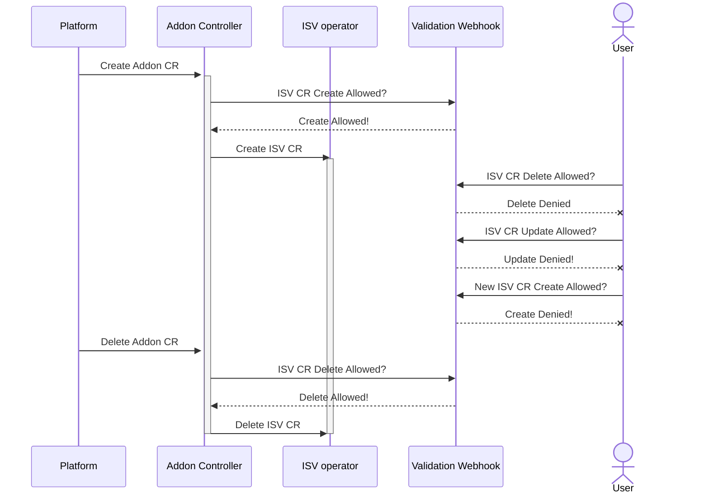

# ISV Addon operator template

[Sequence Diagram Quick Access](#sequence-diagram)

## Prologue

This repository holds a template for creating ISV Addon operator in OSD, it is a starting point from which to start developing your operator<br/>
The design leverages *OLM* dependencies mechanism for operator dependencies.<br/>
A *Dynamic Admission Webhook* for provisioning the *Enterprise* CR modifications.<br/>
And a *Finalizer* for cleaning up the *Enterprise* CR.

## Repository content

Next to this document, you'll find the template operator with its bundle manifest (deployed to *quay.io*).

The [isv-addon](/isv-addon) controller is the shell for the new design, this part will be implemented in our current operator, if this design gets accepted.

The [olm-catalog](/olm-catalog) folder holds the sources for the OLM catalog.

## Design walkthrough

The *isv-addon* describes the *enterprise* package as its dependency and runs 2 controllers.<br/>
The *addon* controller creates the *ISV* CR.<br/>
The *webhook* controller provisions all *ISV* CRs.<br/>
The *addon* controller leverages a *finalizer* for cleaning up existing *ISV* CRs.

In this design, the *addon* controller handles the following actions:<br/>
Reconciling the required resources, i.e. secrets, prometheus servers, and service monitors.<br/>
And eventually deploying the required *ISV* CR.

## Entity Relationship

## Sequence Diagram



## Implementing ISV addon operator using this template
New ISV operator written using this template repository must implement this method
```go
type CommonISV interface {
    GetISVPrefix() string
}
```
In addition the file [enterprise-crd.env](isv-addon%2Fenterprise-crd.env) should also be filled with the appropriate values,
it is used by kustomize for dynamic values, for example:
```dotenv
KIND=StarburstEnterprise
GROUP=example.com.example.com
VERSION=v1alpha1
PLURAL=starburstenterprises
```

If ISV specific logic is needed it should be written in functions which should be added to the isvCustomFuncs array.<br/>
If modification of the ISV cr read from the secret is needed, it should be written in functions which should be added to the isvCustomPatches array.<br/>
Then an init method needs to be added to the [load_isv_funcs.go](isv-addon%2Fpkg%2Fisv%2Fload_isv_funcs.go) and in it the function specified above should be added to the appropriate arrays for example:

```go
func init() {
    isvCustomFuncs = append(isvCustomFuncs, funcX)
    isvCustomPatches = append(isvCustomPatches, funcY)
}
```

Addon Operator dependencies should be specified in the [dependencies.yaml](isv-addon%2Fbundle%2Fmetadata%2Fdependencies.yaml) file including dependencies to the isv-operator, for example:
```yaml
dependencies:
- type: olm.package
  value:
    packageName: isv-operator(starburst-operator for example)
    version: "0.0.1"
- type: olm.package
  value:
    packageName: ose-prometheus-operator
    version: "4.10.0"
```
